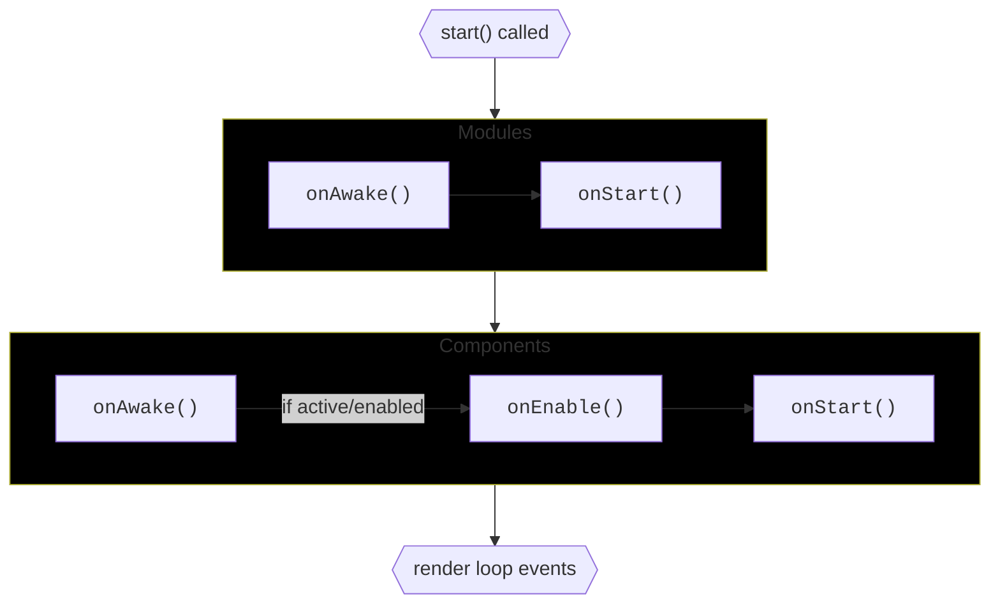
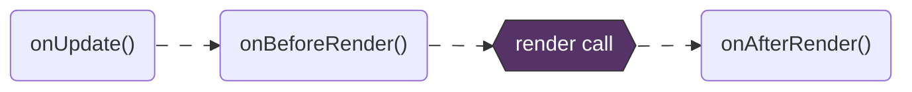
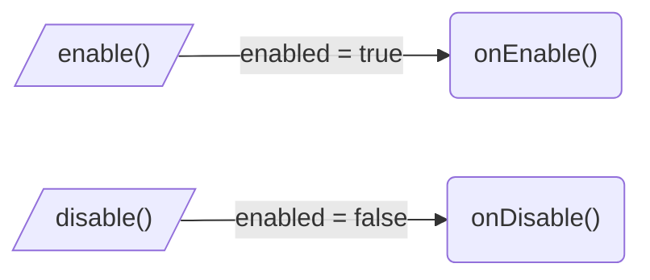

Two kinds of entities share the same set of named event methods:

| Kind | What it is |
|---|---|
| **Module** ([`ContextModule`](/docs/api/context-module)) | Global system. Always on once registered. |
| **Component** ([`Object3DBehaviour`](/docs/api/object3d-behaviour)) | Behaviour added to a single `Object3D` via `addComponent()`. Can be enabled / disabled / destroyed. |

Modules can't be destroyed or disabled/enabled. Everything else they share with components.

## Bootstrap

`start()` of `ThreeStart` instance is called once and it starts lifecycle.



- **Modules first, in `onAwake` → `onStart` order, fully finished before any component lifecycle starts.** Once a component's `onAwake` runs, every module has already gone through both phases — so `this.modules.<key>` is safe to use from `onAwake` onwards.
- **Then components, in `onAwake` → `onEnable` → `onStart` order.**
- **`onEnable` and `onStart` fire only on active components.** A component is active when it is `enabled` AND no ancestor was made inactive via `setActive(ancestor, false)`. Inactive components stop at `onAwake` and wait — the moment they become active, `onEnable` → `onStart` fires for them.
- **Inside one phase, the order matches registration / scene-graph order.** Modules run in the order you passed to `addModules()`. Components run in scene-graph traversal order.

<Callout type="warn">
  Bootstrap touches **only**:

  - **Modules** registered on your `ThreeStart` instance via `addModules()`.
  - **Components** added via `addComponent()` to objects that were added to the **active** scene (`ctx.scene`). Other registered scenes bootstrap on their first [`setScene`](/docs/api/three-start) after `start()`.
</Callout>

<Callout type="info">
  If a module's `onAwake` / `onStart` spawns objects with components, those components don't become active mid-bootstrap — they wait their turn.
</Callout>

## Render loop
Also known as the animation loop. Each frame, in order:



<Callout type="info">
  In every render loop event method, **all modules run before any component**. A module can mutate state in `onUpdate` and every component sees the result the same frame.
</Callout>

<Callout type="note">
  Render loop event methods are subscribed **only if you override them**. An empty component pays nothing for dispatch.
</Callout>

## When a component starts its lifecycle

A component starts its lifecycle the moment **all three** of these are true:

* [x] The component was added to an `Object3D` via `addComponent(obj, MyComp)`.
* [x] That object was added to the **active** scene tree of your `ThreeStart` instance (`ctx.scene`). Components on a registered scene that is not currently shown wait until [`setScene`](/docs/api/three-start) brings that scene forward — see [Scenes](/docs/core-guides/scenes).
* [x] `ThreeStart.start()` was called.

<Callout type="info">
**The order in which you do these doesn't matter.** You can call `addComponent` before `start()` or after; you can add the component to an object that's already in the scene tree, or to one that gets added later. Whichever route you take, the moment the last of the three holds, the component becomes active and runs its first-activation event methods.
</Callout>

```ts title="1. addComponent → object added to scene → start"
const starter = new ThreeStart();
const obj = new THREE.Object3D();

addComponent(obj, MyComp);
starter.ctx.scene.add(obj);
starter.start();  // MyComp: onAwake -> onStart -> onEnable -> render loop events // [!code highlight]
```

```ts title="2. object added to scene tree → start → addComponent"
const starter = new ThreeStart();
const obj = new THREE.Object3D();

starter.ctx.scene.add(obj);
starter.start();
addComponent(obj, MyComp); // MyComp: onAwake -> onStart -> onEnable -> render loop events // [!code highlight]
```

```ts title="3. start → addComponent → object added to scene"
const starter = new ThreeStart();
const obj = new THREE.Object3D();

starter.start();
addComponent(obj, MyComp);
starter.ctx.scene.add(obj); // MyComp: onAwake -> onStart -> onEnable -> render loop events // [!code highlight]
```

## Enable/Disable an alive component
Component's `enable()` / `disable()` methods fire the matching event method and flip `enabled`.



<Callout type="info">
  While a component is disabled, its render loop event methods (`onUpdate` / `onBeforeRender` / `onAfterRender`) don't fire. They resume on the next `enable()`.
</Callout>

[`setActive(obj, ...)`](/docs/core-guides/set-active) toggles whole subtrees — fires `onEnable` / `onDisable` on every component inside. The object's active state takes priority over the component's own `enabled`: an enabled component on an inactive-in-hierarchy object sits idle. By default every object is active; `setActive` is the opt-in switch for parts of the hierarchy. See the [setActive guide](/docs/core-guides/set-active) for the full story.

## Destroy

Pass a component to [`destroy(comp)`](/docs/api/operations) to destroy it:

- `onDisable()` (if it was enabled) → `onDestroy()` fires.
- The lifecycle stops; the component unsubscribes from the render loop.
- The component is removed from the object's component list.

Pass an `Object3D` to [`destroy(obj)`](/docs/api/operations) to destroy every component on `obj` and on its whole subtree. Order: scene-graph traversal (the object itself first, then each descendant), and on each object — components in the order they were added. After every component is destroyed, the object is removed from its parent.

## Errors in event methods

An event method that throws doesn't take anything else down. three-start catches the error, reports it, and carries on:

- **Bootstrap keeps going.** A module whose `onAwake` throws doesn't stop `start()`: the other modules still awake and start, and every component still boots.
- **The frame keeps going.** A throwing `onUpdate` skips only that one call. Every other module and component still gets `onUpdate`, `onBeforeRender` and `onAfterRender` in the same frame, and the scene still renders.
- **The same goes for listeners.** A listener you subscribed with `ctx.on(...)` that throws is isolated the same way, for every `ThreeContextEvents` event.

Each error fires [`ThreeContextEvents.Error`](/docs/api/three-context#events) with the error, the component or module that threw, and the method name:

```ts
import { ThreeContextEvents } from "three-start";

starter.ctx.on(ThreeContextEvents.Error, (error, source, hook) => {
  // source: the component or module, or null for a plain ctx.on(...) listener
  // hook: "onAwake", "onUpdate", ... or the event name ("resized") for a listener
  showErrorInUi(error, source, hook);
});
```

Without an `Error` listener, the error goes to `console.error`. It is never swallowed.

### What happens to the component

Nothing. A component whose event method threw stays attached and enabled, and its lifecycle carries on as if the method had returned: if `onAwake` throws, `onEnable` and `onStart` still run, and `onUpdate` keeps being called every frame. If later methods depend on what the failed one set up, they will most likely throw too, every frame.

To stop a faulty component, decide that in your `Error` listener:

```ts
starter.ctx.on(ThreeContextEvents.Error, (error, source) => {
  if (source instanceof Object3DBehaviour) source.disable(); // [!code highlight]
});
```

Disabling (or destroying) a component from the listener while it is activating stops the rest of the activation: after an `onAwake` that throws, followed by `disable()`, the component gets no `onEnable`, `onStart` or per-frame methods. Whether it gets `onDisable` depends on when it was activated:

- **Added or enabled after `start()`**: it was already active when `onAwake` ran, so `disable()` calls `onDisable`.
- **In the scene before `start()`**: its `onAwake` runs in the engine's awake pass, before any component is active, so `disable()` only clears the flag and `onDisable` doesn't run.

<Callout type="warn">
  Only synchronous code is covered. An error thrown later from a promise, `setTimeout`, or a DOM listener your component registered is not part of the lifecycle call and never reaches `Error`.
</Callout>

## Cheat sheet

| Hook | When | Component | Module |
|---|---|---|---|
| `onAwake` | Once, on first activation | ✓ | ✓ |
| `onStart` | Once, after `onAwake` (and after `onEnable` on components) | ✓ | ✓ |
| `onEnable` | Each entry into Active | ✓ | — |
| `onDisable` | Each exit from Active | ✓ | — |
| `onUpdate` | Each frame, before render | ✓ | ✓ |
| `onBeforeRender` | Each frame, just before draw | ✓ | ✓ |
| `onAfterRender` | Each frame, just after draw | ✓ | ✓ |
| `onDestroy` | Once, on `destroy(...)` | ✓ | — |